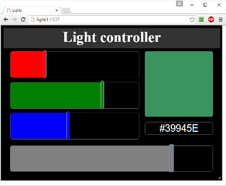

# gnkspi
SPI driver and tools for Win10 IoT [Light Controller](https://www.hackster.io/gera_k/rpi2-win10-iot-based-light-controller-e73990) project 
## Tools
- Rpi2 board running Windows 10 IoT build 10556.
- Visual Studio 2015.
- Windows Driver Kit 2015.
- Node.js Tools for Visual Studio.

## Kernel driver
The kernel driver gnkspi replaces the SPI driver that comes with Win IoT. Note that _standard_ SPI API becomes unavailable as soon as you install this driver.

1. Compiling the driver.
 - Open the solution **gnkspi.sln** and select the **gnkspi** project. Make sure that platform is set to **ARM** and configuration to **Release**. 
 - Rebuild Project. Driver files will be put into ARM/Release directory. 
 - You need .sys and .inf files. Copy them into your Rpi2 into directory of your choice.

2. Installing the driver
 - Run Power Shell and connect to your Rpi2 as documented in [Using PowerShell](http://ms-iot.github.io/content/en-US/win10/samples/PowerShell.htm).
 - cd to directory where driver files are located and do:
 
			devcon update .\gnkspi.inf ACPI\BCM2838
			Updating drivers for ACPI\BCM2838 from C:\Users\Gera\Documents gnkspi.inf.
			Drivers installed successfully.`
    
 - Verify that driver is installed and started:
 
		   	devcon status ACPI\BCM2838
           	ACPI\BCM2838\0
              Name: CNKSpi Driver
              Driver is running.
           	1 matching device(s) found.
           
           
## gnkctl - driver test tool
The **gnkctl** command line utility allows testing of the kernel driver API. It can also be used to briefly validate light show files in json format.

1. Compiling the gnkctl.
 - Select project **gnkctl** and ensure that platform/configuration are set to **ARM** and **Release**.
 - Rebuild the project. The utility binary can be found in the ARM/Release directory.
 - Copy the **gnkctl.exe** to your Rpi2 board.
 - Also copy test files showX.json to Rpi2.
 
2. Running tests
 - Login to your Rpi2 using PowerShell.
 - cd to directory where you have copied the utility.
 - to get optopns help:
 
 			.\gnkctl -h

 - to list available gnkspi devices:
 
			.\gnkctl list
			  List GNK devices
			  0: \\?\ACPI#BCM2838#0#{de0dbb94-7f49-415d-80f6-168b6872e2b3}

 - to start light show defined by a json file:
 
			.\gnkctl -d 0 show .\show1.json

 - to stop the show
 
 			.\gnkctl -d 0 stop
            
## NodeJS addon GnkSpiAddon.
The addon provides driver API to JavaScript applications running under NodeJS.

1. Compiling the addon.
 - Select project **gnkaddon** and ensure that platform/configuration are set to **ARM** and **Release**.
 - Rebuild the project. The addon binary GnkSpiAddon.node can be found in the Release subdirectory of the main solution directory.
 - Copy the **GnkSpiAddon.node** to your Rpi2 board.
 - Also copy test file test.json to Rpi2.

2. Install NodeJS(Chakra) onto your Rpi2 board as documented in, say, this [sample](http://ms-iot.github.io/content/en-US/win10/samples/Nodejs.htm).

3. Running tests
 - Ensure that test.js and GnkSpiAddon.node are located in the same directory.
 - run test.js under Node:
 
 				& "C:\Node.js (Chakra)\node.exe" test.js show0
				& "C:\Node.js (Chakra)\node.exe" test.js show1
				& "C:\Node.js (Chakra)\node.exe" test.js show2
				& "C:\Node.js (Chakra)\node.exe" test.js stop

## NodeJS GUI
A simple Web GUI allows some level of control from any modern WEB browser running on any device (such as PC/Tablet/Smartphone).

#### Installing missing scripts
Open the **ghkspi** solution and select **gnkts** project.
 
1. Install the following node modules:
 - express
 - body-parser
 - morgan
2. Install the following TS type definitions:
 - node
 - express
 - body-parser
 - morgan
 - es6-promise

#### Building the GUI
The GUI is written in TypeScript so the project must be built before it can be deployed to Rpi2. Open the **ghkspi** solution and select **gnkts** project. Rebuild it. It is possible to run it in a browser on your development PC. The app will use light fixture emulator instead of real hardware. The emulator just prints out all received commands to the console.

#### Deploying the GUI to RPi2
Select directory on your Rpi2 board where **GnkSpiAddon.node** and create sub-directory **gnkts**. Copy the following files into **gnkts**:

- *.js
- public/*
- node_modules/*

#### Running the GUI
- Open PowerShell session to your Rpi2.
- cd to **gnkts** directory.
- run the server app:
					
		"C:\Node.js (Chakra)\node.exe" server.js

- The server should start listening on port 1337. Open a browser and point it to IP address of your Rpi2, port 1337.

